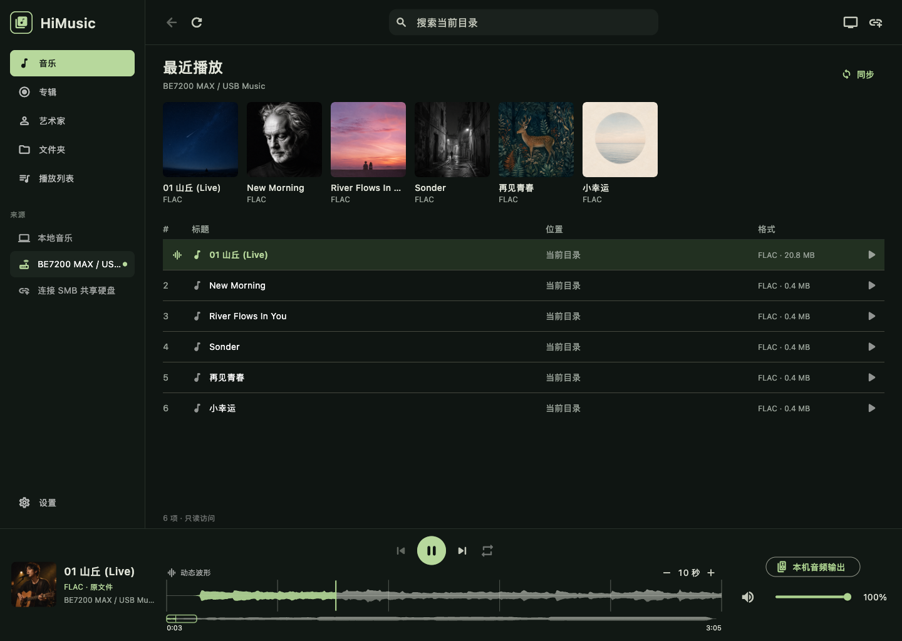

# HiMusic

**English** · [简体中文](README.zh-CN.md)

### Your lossless music. Shared at home. Ready on every screen.

HiMusic turns the USB drive attached to your home router into a private family music library. It connects directly through SMB, plays FLAC and other local audio files, and does not require a NAS, cloud account, or always-on media server.



## One library, every screen

HiMusic is being built as one product for **Windows, macOS, iOS, Android, and Android TV / Google TV**. Each device reads from the same shared music folder while keeping its own playback queue, volume, and listening session.

| Platform | Intended experience | Current prototype status |
| --- | --- | --- |
| macOS | Full desktop library and audio-output selection | Release build verified with local FLAC playback and waveform rendering |
| Windows | Desktop library for mouse and keyboard | Project target included; Windows-host validation is still required |
| iPhone / iPad | Touch-first personal player | Simulator build verified; device import and background playback remain planned |
| Android | Touch-first personal player | Debug build available; physical-device validation remains planned |
| Android TV / Google TV | Living-room player with a large-screen layout | TV layout included; remote-control and real-TV playback still need validation |

## What HiMusic can do today

- **Play from your router:** connect to an SMB 2/3 share such as a USB drive attached to a ZTE Wentian BE7200 MAX.
- **Play local folders:** open music stored directly on a desktop computer.
- **Keep the original audio:** stream FLAC files with ranged reads and client-side decoding, without server transcoding.
- **Show the music in detail:** browse a smooth, high-resolution waveform with zoomable detail, a full-track overview, and click-or-drag seeking.
- **Control playback:** play, pause, skip, seek, retry failed reads, and manage an independent queue on each device.
- **Control your listening device:** adjust app volume, mute and restore, and open platform-appropriate audio-output controls.
- **Fit the room:** use the compact desktop layout or switch to a larger TV-oriented presentation.
- **Protect the source library:** SMB access is read-only, and the prototype never deletes, renames, or rewrites music files.

## Made for a simple home setup

```text
USB hard drive
      │
Home router with SMB
      │
      ├── macOS / Windows
      ├── iPhone / Android phone
      └── Android TV / Google TV
```

There is no central playback session: one person can listen on a computer while someone else plays a different album on the TV. The router only shares files; it does not need Docker, Navidrome, or a transcoding service.

## Current product boundaries

HiMusic 0.3.0 is a working prototype rather than a store-ready release. Tag-based artists and albums, persistent favorites and playlists, mobile background controls, account sync, offline downloads, and phone-to-TV control are still on the roadmap. Real-router concurrency, TV remote navigation, sleep recovery, and device-specific high-resolution output also need hardware testing.

HiMusic reads original FLAC data, but this alone does not guarantee bit-perfect output; the operating system and playback device still control the final audio path.

## Run the prototype

HiMusic currently uses Flutter 3.47.2.

```sh
./scripts/flutter.sh pub get
./scripts/flutter.sh run -d macos
```

Build the Android / Google TV debug package with:

```sh
./scripts/flutter.sh build apk --debug
```

Inside the app, choose **Open Local Folder** for music on the computer, or **Connect SMB Share** for a router-connected drive. SMB passwords stay in memory for the current session and are not saved to disk.

## Product and development notes

- [Product specification](SPEC.md)
- [Implementation and validation history](docs/DEVELOPMENT.md)
- [High-resolution waveform research](docs/research/dynamic-waveform.md)
- [UI design QA](design-qa.md)
